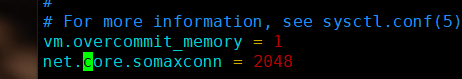

# Cenotos参数优化

## 内核相关参数(/etc/sysctl.conf)



#### 修改时期生效

```shell
/sbin/sysctl -p 
/sbin/sysctl -w  net.ipv4.route.flush=1
```


### 网络参数

```shell
## 提交并发
net.core.somaxconn=65535
net.core.netdev_max_backlog=65535
net.ipv4.tcp_max_syn_backlog=65535
```

### Tcp连接等待时间和回收

```
net.ipv4.tcp_fin_timeout=10
net.ipv4.tcp_tw_reuse=1
net.ipv4.tcp_tw-recycle=1
```

###  Tcp缓冲区

```
net.core.wmem_default=87380
net.core.wmem_max=167771216
net.core.rmem_default=87380
net.core.rmem_max=167771216
```

### 加快Tcp回收资源的效率

```
net.ipv4.tcp_keepalive_time=120
net.ipv4.tcp_keepalive_intvl=30
net.ipv4.tcp_keepalive_probes=3
```

###  共享内容参数  .  <font color='red'>注意,这个参数应该设置足够大,以便能在一个共享内存下容纳整个的Innodb缓冲池的大小</font>

```html
kernel.shmmax=4294967295
### 交换分区
vm.swappiness=0
```

# 修改服务器最大打开文件的数量

```shell
### 修改服务器最大打开文件的数量

ulimit -n
##修改文件
/etc/rc.local
ulimit SHn 65535 
##修改文件
/etc/profile  
ulimit -SHn  65535
##/etc/security/limits.conf  vim /etc/security/limits.conf


* soft nofile 65535
* hard nofile 65535


```

