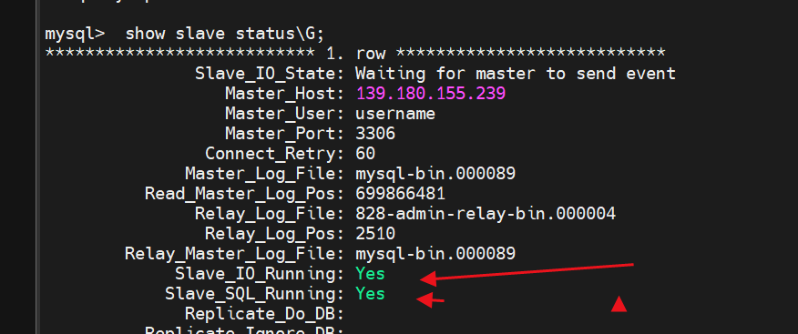
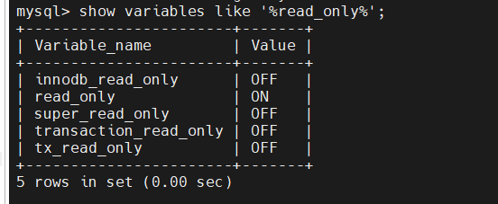

# Mysql主从复制

####  说明:

1. 大版本一致，比如都是5.6，或者都是5.7，版本不一容易复制失败
2. 数据必须先同步，也就是先保持2边数据一致，同步成功前主库不要有数据变动


## 主库

#### 修改配置文件  vi /etc/my.cnf

  ```shell
  ## 打开配置文件
  vi /etc/my.cnf
  ```

####  修改内容

```
log-bin=mysql-bin   #[必须]启用二进制日志
server-id=100       #[必须]服务器唯一ID(唯一即可)  
binlog-do-db=ball   #需要同步的数据库
```

#### 重启

```shell
systemctl restart mysqld
```


#### 登录数据库,并且创建用户

````shell
mysql -uroot -p
GRANT REPLICATION SLAVE ON *.* to 'username'@'%' identified by 'password'; 
show master status;  ##查看主库状态，记下File字段和Position字段，从库要用
````


### 从库修改

#### 修改配置文件 vi /etc/my.cnf

```shell
##打开配置文件
vi /etc/my.cnf
```

#### 修改内容

```
log-bin=mysql-bin   #[必须]启用二进制日志
server-id=100       #[必须]服务器唯一ID(唯一即可)  
binlog-do-db=ball   #需要同步的数据库
```


####  进入数据库

```shell
mysql -uroot -p  
```

#### 输入

```mysql
change master to master_host='139.180.155.239',master_port=3306,master_user='username',master_password='password',master_log_file='mysql-bin.000095',master_log_pos=145604639;  
```


#### 重启并且重新进入mysql

```shell
## 重启
systemctl restart mysqld
```


#### 进入mysql执行命令

```mysql
stop slave;  
set GLOBAL SQL_SLAVE_SKIP_COUNTER=1;  
start slave; 
##  查看状态
show slave status\G;    ##两个Yes表示同步成功
```



# 修改从数据库为只读模式

```mysql
## 查看read_only 状态
SHOW VARIABLES LIKE '%read_only%'
##设置为只读模式
SET GLOBAL read_only=1 #或者为on
```




#  高并发下数据库参数配置

```mysql
###  这个参数用于配置InnoDB存储引擎使用的内存缓冲池大小。在高并发的情况下，应该适当增加这个值，以提高系统性能。建议将其设置为物理内存的70%-80%左右。
innodb_buffer_pool_size
###  这个参数用于配置MySQL服务器允许的最大并发连接数。在高并发的情况下，应该适当增加这个值，以允许更多的客户端连接到服务器。但是，需要注意不要超过系统的最大承受能力。
max_connection
### 这个参数用于配置MySQL服务器线程缓存的大小。在高并发的情况下，应该适当增加这个值，以避免频繁创建和销毁线程的开销。
thread_cache_size
### 这这个参数用于配置MySQL查询缓存的大小。在高并发的情况下，应该适当增加这个值，以提高查询的响应速度。但是，需要注意，如果缓存的查询语句过多，可能会占用太多的内存资源。
query_cache_size
### 这个参数用于配置InnoDB存储引擎事务日志的刷新方式。在高并发的情况下，建议将其设置为1，以确保每个事务的日志都被持久化到磁盘上，从而提高系统的可靠性。
innodb_flush_log_at_trx_commit=1
### 这个参数用于配置InnoDB存储引擎的事务日志文件的大小。在高并发的情况下，应该适当增加这个值，以避免事务日志文件被频繁切换的开销。建议将其设置为物理内存的10%-25%左
innodb_log_file_size
```


