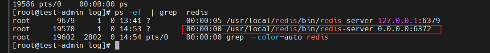
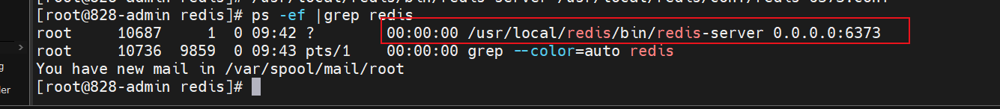
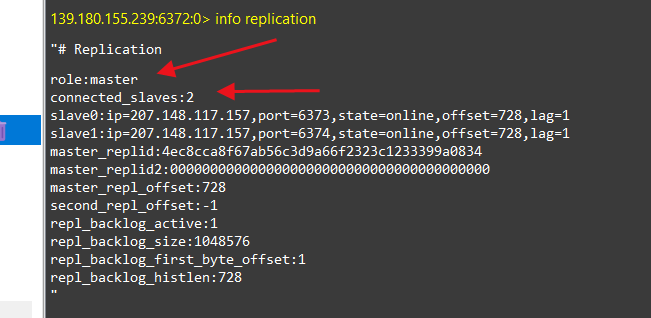
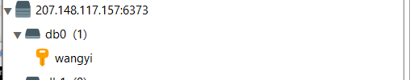
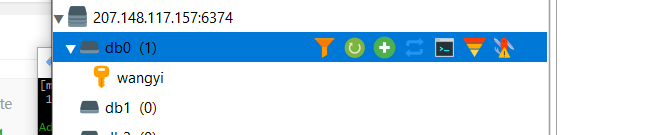
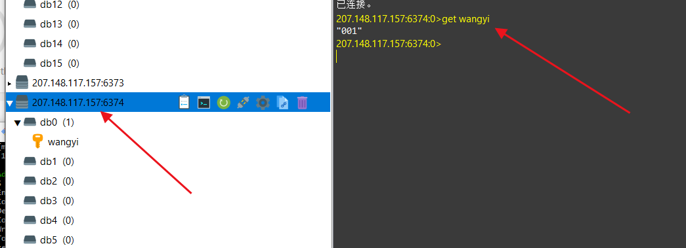
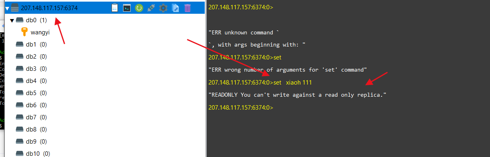

# Redis主从复制

## 准备环境


| IP              | 端口 | 角色   |
| --------------- | ---- | ------ |
| 139.180.155.239 | 6372 | Master |
| 207.148.117.157 | 6373 | Slave  |
| 207.148.117.157 | 6374 | Slave  |

### 1.创建文件(主,从)

```shell
mkdir /usr/local/redis/data
mkdir /usr/local/redis/log
mkdir /usr/loacl/redis/conf
```

### 2.创建配置文件 (名字,:端口号.conf)

```shell
vim  /usr/local/redis/conf/redis-6371.conf
```

### 3.主配置文件内容

````s
# 放行访问IP限制  
bind 0.0.0.0
# 端口
port 6372
# 后台启动
daemonize yes
# 日志存储目录及日志文件名
logfile "/usr/local/redis/log/redis-6372.log"
# rdb数据文件名
dbfilename dump-6372.rdb
# aof模式开启和aof数据文件名
appendonly yes
appendfilename "appendonly-6372.aof"
# rdb数据文件和aof数据文件的存储目录
dir /usr/local/redis/data
# 设置密码
requirepass TX$bZm6ZE@cXJpLo
# 从节点访问主节点密码(必须与 requirepass 一致)
masterauth TX$bZm6ZE@cXJpLo
# 从节点只读模式
replica-read-only yes
````

###  4.启动 Redis,并且检查是否启动成功

```shell
## 启动
/usr/local/redis/bin/redis-server /usr/local/redis/conf/redis-6372.conf
## 检查是否启动成功
ps -ef |grep redis
```



### 5.从服务器 配置,这只展示从服务器:6373的操作

```
## 创建配置文件
 vim  /usr/local/redis/conf/redis-6373.conf
```

### 6.从的配置文件内容和主的差不多,就是在后面加上  slaveof  主的ip 端口,

```
# 放行访问IP限制  
bind 0.0.0.0
# 端口
port 6373
# 后台启动
daemonize yes
# 日志存储目录及日志文件名
logfile "/usr/local/redis/log/redis-6373.log"
# rdb数据文件名
dbfilename dump-6373.rdb
# aof模式开启和aof数据文件名
appendonly yes
appendfilename "appendonly-6373.aof"
# rdb数据文件和aof数据文件的存储目录
dir /usr/local/redis/data
# 设置密码
requirepass TX$bZm6ZE@cXJpLo
# 从节点访问主节点密码(必须与 requirepass 一致)
masterauth TX$bZm6ZE@cXJpLo
# 从节点只读模式
replica-read-only yes
######新增这里
slaveof  139.180.155.239 6372
```

### 7.启动

```shell
/usr/local/redis/bin/redis-server /usr/local/redis/conf/redis-6373.conf
## 查看是否启动
ps -ef |grep redis
```



### 8.连接主redis,输入命令查看

```shell
info replication
```



### 9.测试主从情况

```
##在主的redis输入 set wangyi 001
set wangyi  001
```

#### 从1库截图



#### 从2库截图



#### 可以看出从库都同步过去了!

### 10,测试从库只读功能,不可以写入

#### 读



#### 写


