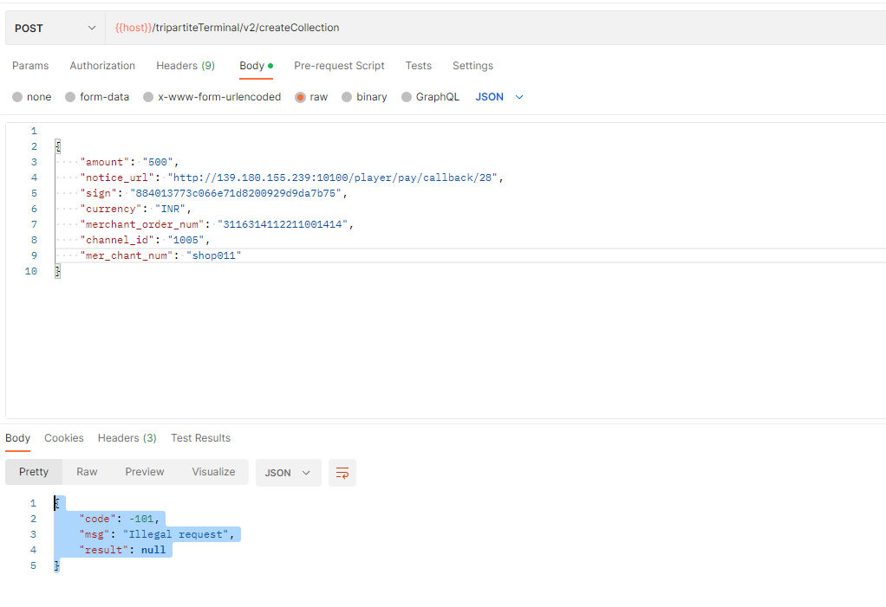

# 三方对接文档

##  API接口说明

### 请求方式

######       所有请求接口方式都是Post方法,使用Json方式提交.  

````json
 
 {
     "amount": "500",
     "notice_url": "http://139.180.155.239:10100/player/pay/callback/28",
     "sign": "884013773c066e71d8200929d9da7b75",
     "currency": "INR",
     "merchant_order_num": "3116314112211001414",
     "channel_id": "1005",
     "mer_chant_num": "shop01"
 }
````

### 签名算法

######   提交的所有参数进行Ascii码进行排序,然后末尾加上&key=xxxx,进行MD5加密,生成sgin,然后提交

```
amount=500&channel_id=1005&currency=INR&mer_chant_num=shop01&merchant_order_num=3116314112211001414&notice_url=http://127.0.0.1/player/pay/callback/28&key=xxxx
```

### 接口返回数据格式(成功)

```json
{
    "code": 200,    //code=200成功  -101 失败
    "msg": "ok",    //如果code=-101,这里返回错误原因
    "result": "https://xxx.com/#/?upi=126&amount=500&order_num=Mer167834532313379&expiration=1678345503"
}
```

# 代收

### 创建订单

###### 简要下单

- 代收下单

###### 请求URL

- /tripartiteTerminal/v2/createCollection

###### 请求方式

- Type:POST
- Content-Type:application/json

###### 参数

|       参数名       | 必选 |  类型  |                            说明                            |
| :----------------: | :--: | :----: | :--------------------------------------------------------: |
|   mer_chant_num    |  是  | string |                    商户号,平台分配账号                     |
| merchant_order_num |  是  | string |             商家订单号(唯一),字符长度在50以内              |
|      currency      |  是  | string |                            币种                            |
|       amount       |  是  | string |              金额，单位卢币(最多保留两位小数)              |
|     notice_url     |  是  | string |                      异步通知回调地址                      |
|     channel_id     |  是  | string | 通道编码，编码值从商户后台“账户信息”页面中或者找客服获取， |
|        sign        |  是  | string |                            签名                            |


###### 返回事例

````json
//成功
{
    "code": 200,
    "msg": "ok",
    "result": "https://xxx.com/#/?upi=125&amount=500&order_num=Mer1678347197623895&expiration=1678347377"
}

//失败
{
    "code": -101,
    "msg": "Illegal request",
    "result": null
}

````

###### 提交参数参考demo



### 查询订单

######  简要描述

###### 请求URL

###### 请求方式

###### 参数

###### 请求示例

###### 返回数据


### 回调通知

######  简要描述


###### 请求URL

- <font color="red">商户代收传入的notice_url</font>

###### 请求方式

- Type：POST
- Content-Type: application/json

###### 参数

###### 请求示例

###### 返回数据


# 代付

### 创建订单

######  简要描述

###### 请求URL

###### 请求方式

###### 参数

###### 请求示例

###### 返回数据


### 查询订单

######  简要描述

###### 请求URL

###### 请求方式

###### 参数

###### 请求示例

###### 返回数据


### 回调通知

######  简要描述

###### 请求URL

###### 请求方式

###### 参数

###### 请求示例

###### 返回数据


# 错误排查


