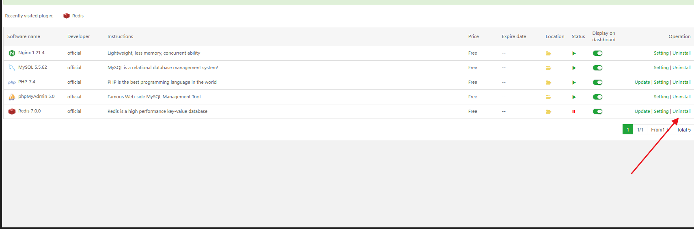
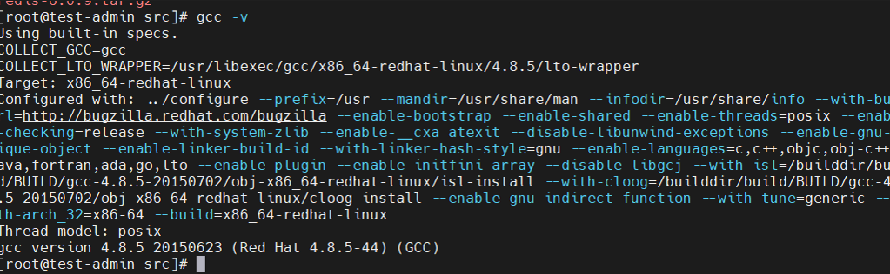
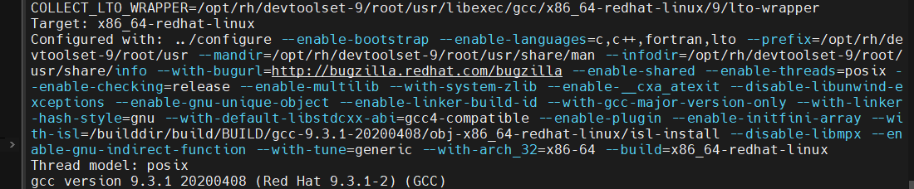
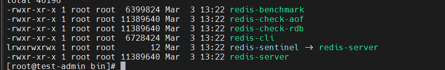
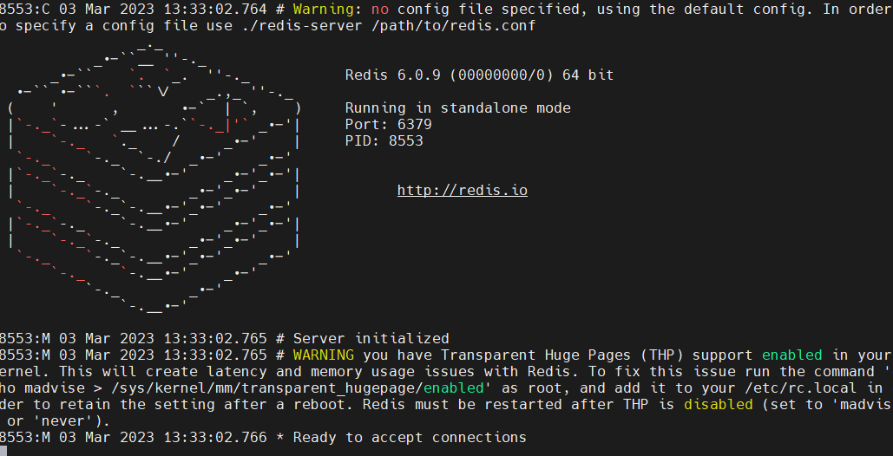
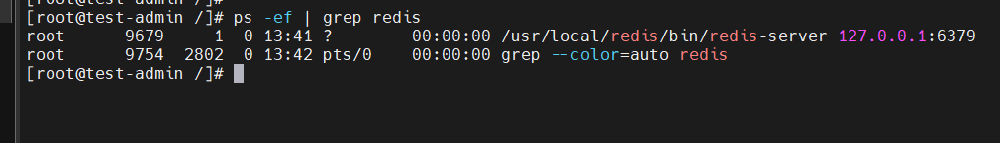

# 服务安装Redis

## 1.卸载宝塔的redis.




##  2.下载redis,下载的版本6.0.9

```shell
wget -P /usr/local/src/ https://download.redis.io/releases/redis-6.0.9.tar.gz
```


## 3.切换到目录下并且解压

```shell
 cd /usr/local/src/ && tar -zxvf redis-6.0.9.tar.gz
```


## 4.创建redis目录

```shell
mkdir -p /usr/local/redis
```

## 5.在编译redis,之前先安装gcc扩张,并且升级的9.版本



##  6.依次执行下面命令

```shell
yum -y install gcc-c++ autoconf automake
# 安装 scl 源
yum install -y centos-release-scl scl-utils-build
# 安装 9 版本的 gcc、gcc-c++、gdb 工具链（toolchian）
yum install -y devtoolset-9-toolchain
# 临时覆盖系统原有的 gcc 引用
scl enable devtoolset-9 bash
# 查看 gcc 当前版本,9.3.1(正确版本)
gcc -v   
```




## 7.安装编译redis

```shell
cd redis-6.0.9 && make  && make PREFIX=/usr/local/redis install
```

##  8.切换到目录:/usr/local/redis/bin

```shell
cd /usr/local/redis/bin  && ll
```



## 9.启动redis

```
./redis-server
```



## 10.redis启动默认的配置文件,是   /usr/local/src/redis-6.0.9/redis.conf ,我们复制过来,并且修改配置文件为后台启动

```shell
## 创建目录
mkdir -p /usr/local/redis/conf/
##复制配置文件到conf下面
cp /usr/local/src/redis-6.0.9/redis.conf  /usr/local/redis/conf/redis.conf
##修改 /usr/local/redis/conf/redis.conf
vim  /usr/local/redis/conf/redis.conf
##找到 daemonize 把后面的no改成yes  --是否后台运行参数配置
##启动,通过刚才修改的配置文件
/usr/local/redis/bin/redis-server /usr/local/redis/conf/redis.conf
## 查看redis运行情况
ps -ef | grep redis
```


