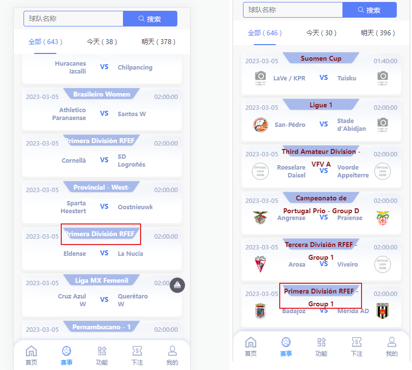
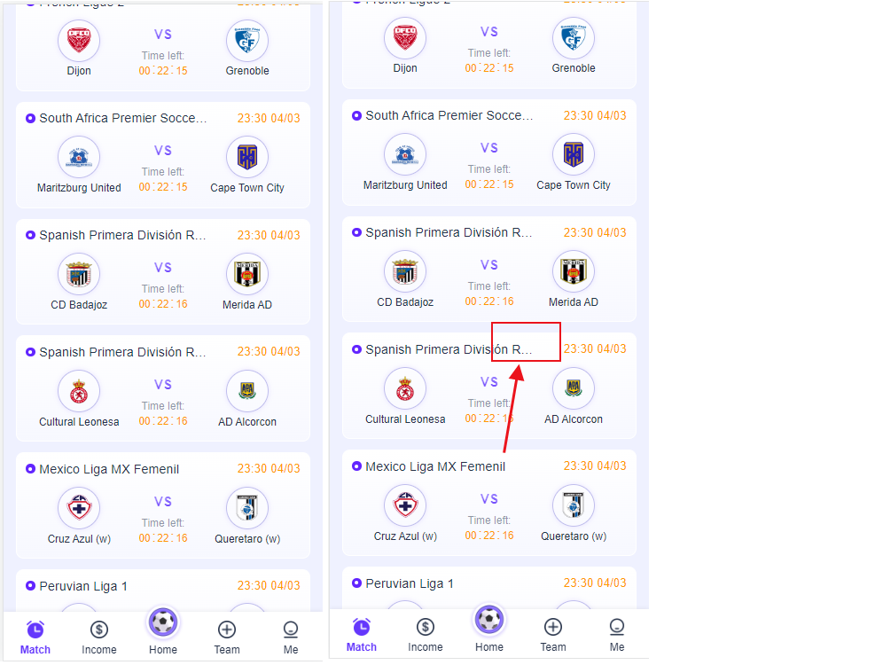
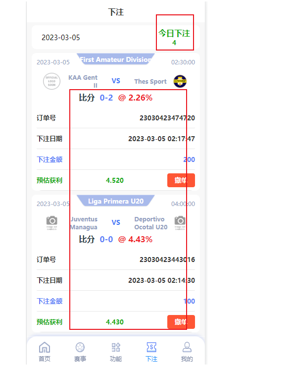
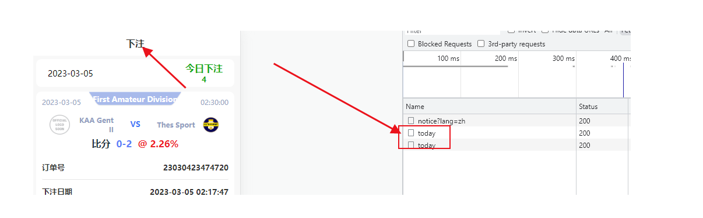
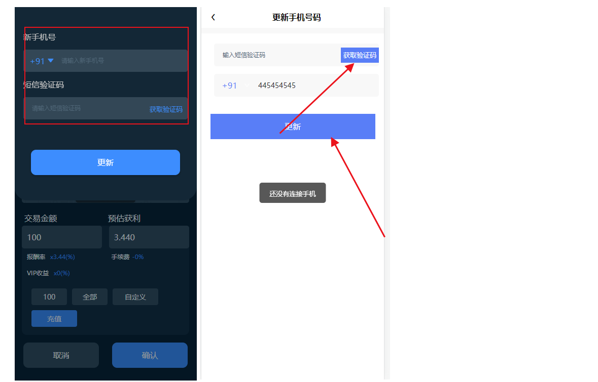
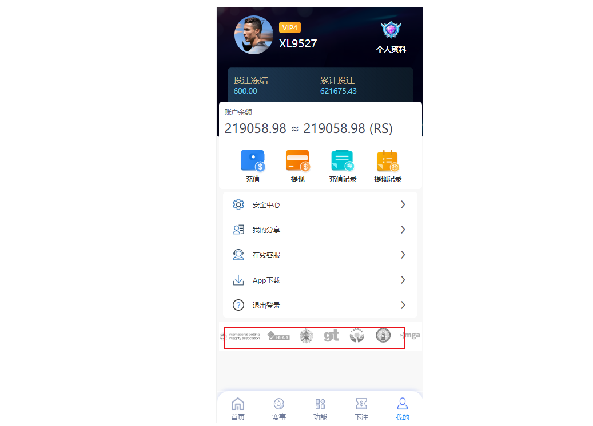
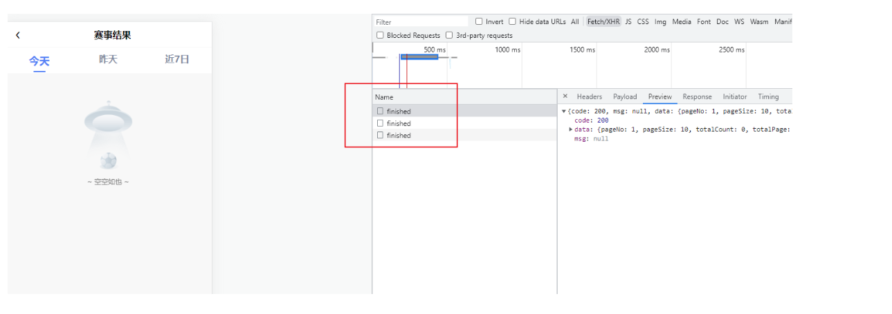
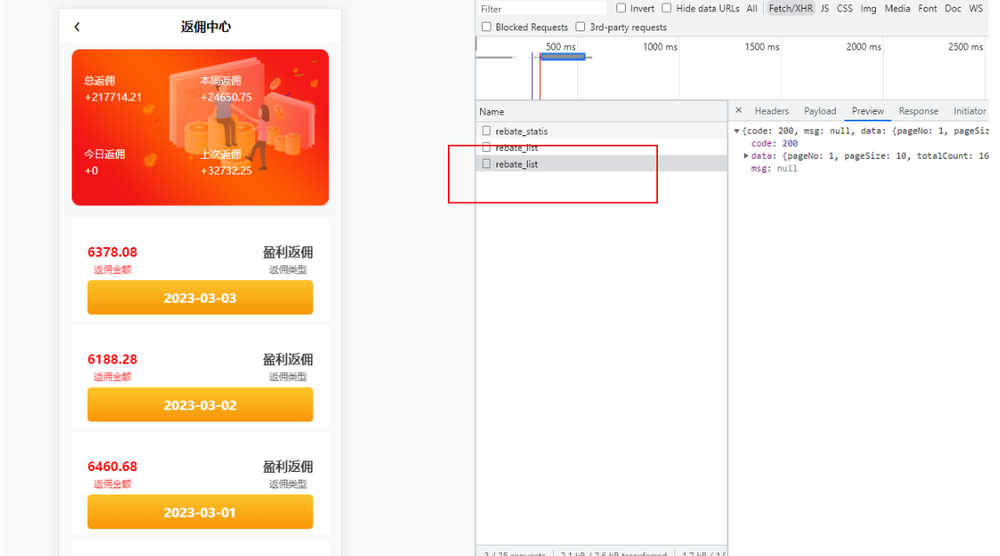
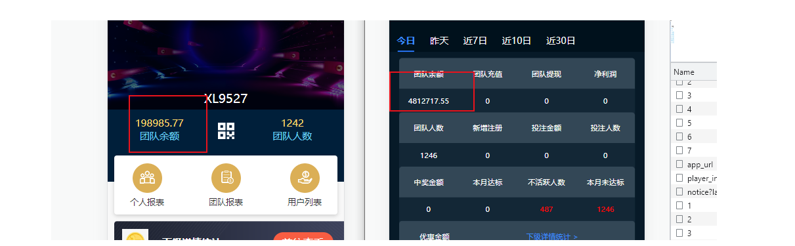

#  第三套模板修改

#### 1.首页,赛事,联赛名字太长,导致显示补完完全.我改完颜色后发现还有怎么多!...



```shell
###修改建议
1.每页可以显示少点,然后增大宽度
2.可以效仿luckly足球,放在左上角显示
3.要把联赛名称都显示出来的
4.每页每页必要显示怎么多比赛,4~5个就可以了

```

2.功能界面修改



```
1.App下载 删除
2.在线客服 删除
3.赛事列表 删除
4.正在交易 删除
```


#### 3.下注,今日下注4,但是撤单的未显示



#### 4.在底部导航"下注"界面,刷新,会请求两次today接口,请删除一个!





#### 5.拿一个没有绑定手机号的账号下注,会跳转界面  "更新手机号",界面短信息在上面,手机号在下面

````
##修改方案
1.还是按照GVF的方案,上面直接,或者做判断,顺序颠倒
2.你可以点击获取验证码,显示,您没有绑定手机号
3.去安全中心的个人资料也无法绑定手机号,你只提供更新手机号的方法

````




#### 6.删除"我的界面",下标广告



#### 7.赛事结果,进来,立刻有三个接口同时发出,优化就一个,只拿今天的




#### 8.返利中心,接口多查



#### 9.代理中心

```
1.团队余额,错误
2.用户列表和下级详情统计 重复,删除一个.....可以自己决定删除那个...
```




#### 10.规则说明,打不开

````
## 
````

